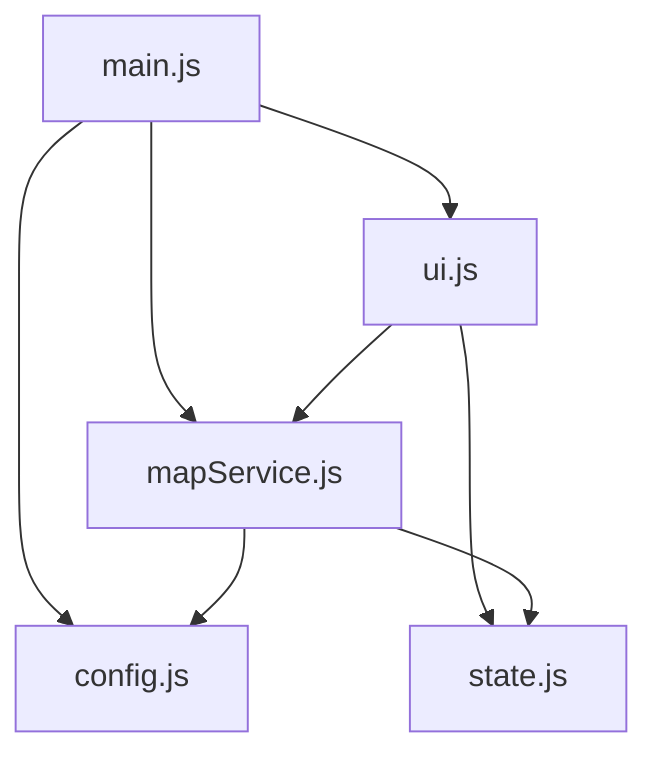

# Multimodal Dual Isochrone

## Modular Architecture

### File Structure

```plaintext
multimodal-dual-isochrone/
├── main.html            # Main HTML entry point
├── style.css            # CSS styles
├── scripts/             # JavaScript modules
│   ├── config.js        # API configuration and constants
│   ├── state.js         # Application state management
│   ├── mapService.js    # AMap API interactions
│   ├── ui.js            # UI event handling
│   └── main.js          # Application entry point
```

### Module Dependencies



### Key Features

- Modular JavaScript architecture (ES6 modules)
- Clear separation of concerns
- Centralized state management
- Configurable API settings
