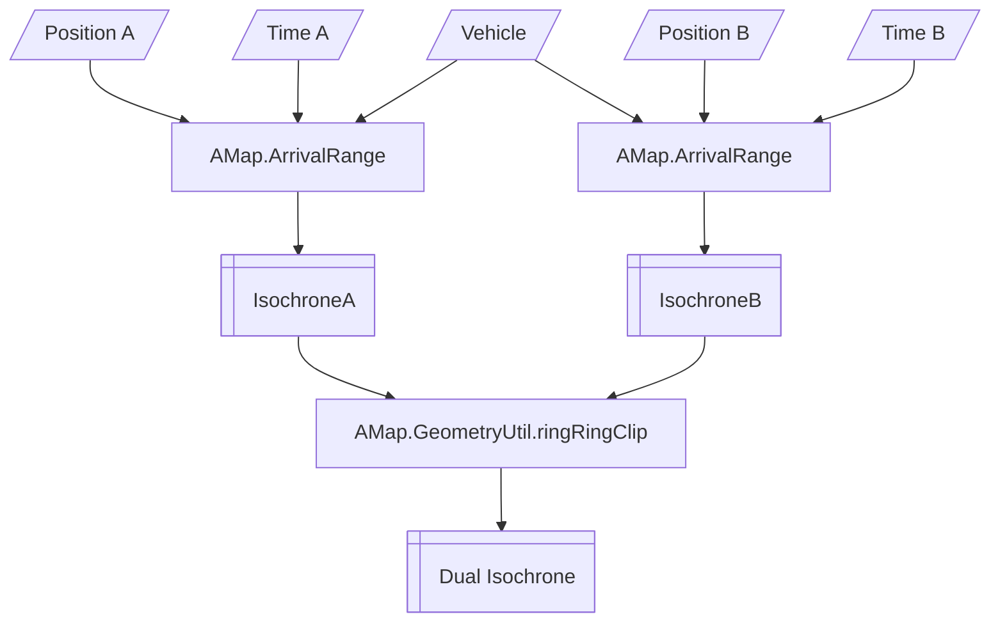

# Multimodal Dual Isochrone

## v1.0 AMap ArrivalRange

- Dual Isochrone Solution with AMap API.
- Supported vehicles: Subway, Bus.

```mermaid
flowchart TD
    A@{ shape: lean-r, label: "Position A" }
    tA@{ shape: lean-r, label: "Time A" }
    V@{ shape: lean-r, label: "Vehicle" }
    B@{ shape: lean-r, label: "Position B" }
    tB@{ shape: lean-r, label: "Time B" }

    pA[AMap.ArrivalRange]
    pB[AMap.ArrivalRange]
    p[AMap.GeometryUtil.ringRingClip]
    IsoA@{ shape: win-pane, label: "IsochroneA" }
    IsoB@{ shape: win-pane, label: "IsochroneB" }
    Iso@{ shape: win-pane, label: "Dual Isochrone" }

    A & tA --> pA --> IsoA
    V --> pA & pB
    B & tB --> pB --> IsoB
    IsoA & IsoB --> p --> Iso
```
